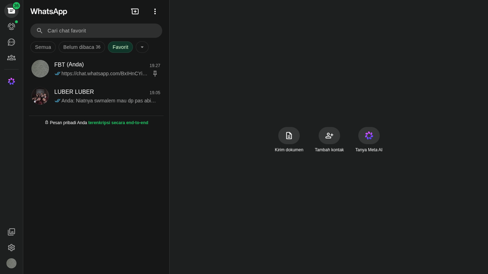

# WhatsZan - Unofficial WhatsApp Desktop Client untuk Linux

<p align="center">

</p>

## Fitur

* **[BARU] Deteksi Tema Sistem Universal**: Secara akurat mendeteksi dan mensinkronisasi tema Gelap/Terang (*Dark/Light Mode*) secara *real-time* di berbagai Desktop Environment Linux (bekerja mulus di GNOME/GTK, maupun KDE Plasma/Hyprland berbasis Qt).
* **[BARU] Jalankan Otomatis & Minimalkan**: Menyala otomatis di latar belakang saat komputer dihidupkan (Dapat diatur melalui Menu Jendela/Window).
* **[BARU] Routing Link Mulus (Anti-Reload)**: Menangani tautan `chat.whatsapp.com`, `wa.me`, dan `whatsapp://` secara *native* tanpa memuat ulang halaman (*reload*) atau menyebabkan layar putih.
* **[BARU] Anti Tracker Bypass**: Otomatis membongkar pelacak tautan internal WhatsApp (`l.wl.co`) sehingga mencegah browser eksternal terbuka secara tidak sengaja.
* **[BARU] Dukungan Multi-Bahasa**: Menu diterjemahkan sepenuhnya ke dalam bahasa Indonesia, Inggris, Jerman, Prancis, Italia, dan Portugis.
* Notifikasi desktop
* Panggilan Telepon / Video berfungsi (kamu harus bergabung dengan WhatsApp Web Beta)
* Ikon tray dengan jumlah pesan belum dibaca (AppIndicator), [ikon tray kustom](#ikon-kustom).
* Pintasan keyboard kustom
* CSS Kustom & Pemeriksa Ejaan (*Spellcheck*)
* Antarmuka CLI & D-Bus untuk memunculkan/menyembunyikan jendela
* Lencana jumlah pesan belum dibaca pada dock & Menyimpan posisi jendela terakhir
* Skrip pengguna kustom di `~/.config/whatszan/user-scripts/*.js`

## Mengapa?

Saya membuat *fork* dari [elecwhat](https://github.com/piec/elecwhat) ini untuk memperbaiki masalah kestabilan pada cara penanganan tautan (`wa.me` / `chat.whatsapp.com`), mencegah jendela browser eksternal terbuka secara tak terduga, dan menambahkan fitur latar belakang yang penting seperti "Jalankan Otomatis & Minimalkan". Aplikasi ini tetap mempertahankan sifatnya yang sederhana, ringan, dan stabil seperti klien aslinya.

## Instalasi

### Ubuntu/Kubuntu:
* [Snap](#)
* **atau** file `.deb` di tab [Releases] dengan `--no-sandbox` karena ada [isu Electron]
* **atau** file `AppImage` di tab [Releases] dengan `--no-sandbox` karena ada [isu Electron]

### Arch Linux:
* Paket AUR: `yay -S whatszan-bin` *(jika tersedia)*
* **atau** paket Pacman di tab [Releases]
* **atau** file `AppImage` di tab [Releases]

### Debian:
* file `.deb` di tab [Releases]
* **atau** file `AppImage` di tab [Releases]

### Fedora:
* file `.rpm` di tab [Releases]
* **atau** file `AppImage` di tab [Releases]

---

**Instalasi Manual (dari Source Code):**

```bash
# Clone repositori
git clone https://github.com/username-kamu/whatszan-electron.git
cd whatszan-electron

# Instal dependensi
npm install

# Jalankan aplikasi
npm start

# Build aplikasi (hasilnya akan ada di folder /dist atau /out)
npm run build
```

## Konfigurasi

`~/.config/whatszan/config.json`:

```json
{
  "log-level": "info",
  "notification-prefix": "whatszan - ",
  "quit-on-close": false,
  "show-at-startup": false,
  "dbus": true,
  "menu-bar": true,
  "menu-bar-auto-hide": true,
  "keys": {
    "C ArrowDown": {
      "whatsappAction": "GO_TO_NEXT_CHAT"
    }
  },
  "esc-toggle-window": false,
  "css": [],
  "spellcheck": true,
  "spellcheck-languages": ["id", "en-US", "fr"],
  "user-agent": "...",
  "open-dev-tools": false,
  "scripts": [],
  "icons-directory": "..."
}
```

## Ikon Kustom

Skema penamaan ikon didasarkan pada URL favicon WhatsApp Web:

* `~/.config/whatszan/user-icons/app.png` saat startup
* `~/.config/whatszan/user-icons/favicon.png` ketika tidak ada pesan belum dibaca
* `~/.config/whatszan/user-icons/f01.png` di mana fXX.png adalah jumlah pesan yang belum dibaca

## Kredit & Ucapan Terima Kasih

Proyek ini adalah *fork* yang dimodifikasi secara ekstensif dari **[elecwhat](https://github.com/piec/elecwhat)**.
Terima kasih yang sebesar-besarnya kepada kreator asli, [piec](https://github.com/piec), yang telah membangun fondasi Electron yang sangat stabil, integrasi DBus, dan struktur *preload script* yang sangat rapi.

Modifikasi pada repositori ini (seperti fitur *Auto-Run*, routing tautan internal yang mulus, pemblokiran *tracker*, dan terjemahan bahasa Indonesia) dikembangkan secara spesifik untuk aplikasi WhatsZan dengan bantuan *AI coding assistant*.
